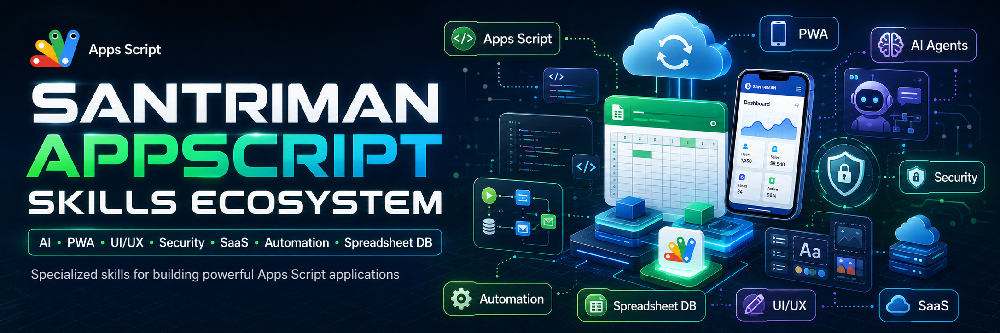

<div align="center">

# Google Apps Script Skills

Koleksi **16 agent skills** modular untuk merancang, meriset arah visual, membangun, mengamankan, menguji, mengoptimalkan, men-deploy, dan **menskala** aplikasi Google Apps Script yang siap produksi.

[](https://github.com/askiya/GOOGLE-APPSCRIPT-SKILLS/actions/workflows/validate.yml)
[](LICENSE)
[](https://developers.google.com/apps-script)
[](https://learn.chatgpt.com/docs/build-skills)

[English](README.en.md) · [Panduan Implementasi](docs/IMPLEMENTATION-GUIDE.md) · [Arsitektur Repo](docs/ARCHITECTURE.md) · [Kontribusi](CONTRIBUTING.md)

</div>

## Kenapa repository ini dibuat?

Google Apps Script sangat cepat untuk membangun automasi dan aplikasi internal, tetapi aplikasi produksi tetap membutuhkan keputusan yang benar tentang authorization, execution identity, quota, concurrency, struktur data, error handling, UI async, pengujian, dan deployment.

Repository ini mengubah empat prompt besar yang bercampur menjadi skill kecil dan terfokus. Agent hanya memuat skill yang relevan, sehingga instruksi lebih presisi, konteks lebih hemat, dan hasil lebih mudah ditinjau.

> Skill adalah instruksi untuk AI coding agent—bukan library yang otomatis berjalan di server Apps Script. Tetap review kode, scope OAuth, deployment identity, dan konfigurasi sharing sebelum produksi.

## Daftar skill

| Skill | Gunakan ketika ingin... |
| --- | --- |
| [`apps-script-architect`](skills/apps-script-architect/) | Mendesain requirement, boundary, folder, data flow, quota strategy, dan rencana implementasi. |
| [`apps-script-web-app`](skills/apps-script-web-app/) | Membangun HTML Service, `doGet`/`doPost`, ContentService API, dan bridge `google.script.run`. |
| [`apps-script-sheets-data-layer`](skills/apps-script-sheets-data-layer/) | Menjadikan Sheets sebagai data layer dengan schema, batch I/O, locks, index, dan migration. |
| [`apps-script-automation`](skills/apps-script-automation/) | Membuat trigger, workflow terjadwal/event-driven, queue, retry, dan idempotency. |
| [`apps-script-design-research`](skills/apps-script-design-research/) | Mencari inspirasi UI/UX dari Dribbble secara aman dan mengubahnya menjadi brief desain orisinal yang siap diimplementasikan. |
| [`apps-script-ui-ux`](skills/apps-script-ui-ux/) | Mendesain UI responsif, accessible, cepat, dan konsisten untuk HTML Service. |
| [`apps-script-pwa`](skills/apps-script-pwa/) | Merencanakan pengalaman installable/offline sambil menangani batas hosting Apps Script secara jujur. |
| [`apps-script-security`](skills/apps-script-security/) | Melakukan threat model, audit auth/authz, scope OAuth, secret, input, output, dan abuse controls. |
| [`apps-script-performance`](skills/apps-script-performance/) | Mengurangi service calls, batching, cache, pagination, timeout, dan quota failures. |
| [`apps-script-testing`](skills/apps-script-testing/) | Menambahkan unit/integration tests, fakes, fixtures, deployment smoke tests, dan release gates. |
| [`apps-script-clasp-deployment`](skills/apps-script-clasp-deployment/) | Menyiapkan local development, clasp, manifest, Git, CI, versioning, dan deployment aman. |
| [`apps-script-integrations`](skills/apps-script-integrations/) | Mengintegrasikan Workspace services, Advanced Services, webhook, dan external REST API. |
| [`apps-script-saas`](skills/apps-script-saas/) | Mendesain aplikasi multi-tenant, roles, entitlements, tenant isolation, audit, dan lifecycle. |
| [`apps-script-ai-integration`](skills/apps-script-ai-integration/) | Menghubungkan model AI secara aman dengan structured output, budget, privacy, dan fallback. |
| [`apps-script-debugging-migration`](skills/apps-script-debugging-migration/) | Mendiagnosis error, trigger, auth, quota, deployment, V8, dan memigrasikan proyek lama. |
| [`apps-script-hybrid-stack`](skills/apps-script-hybrid-stack/) | Menggabungkan Apps Script dengan layanan free-tier (Firebase, Supabase, Cloudflare, Turso, Upstash, MongoDB, Neon, Vercel) untuk skalabilitas hybrid tanpa biaya. |

## Instalasi

### Opsi A — installer otomatis (direkomendasikan)

Clone repository:

```bash
git clone https://github.com/askiya/GOOGLE-APPSCRIPT-SKILLS.git
cd GOOGLE-APPSCRIPT-SKILLS
```

Windows PowerShell:

```powershell
Set-ExecutionPolicy -Scope Process Bypass
.\scripts\install.ps1
```

macOS/Linux:

```bash
chmod +x scripts/install.sh
./scripts/install.sh
```

Secara default installer menyalin seluruh skill ke lokasi user `~/.agents/skills`. Untuk memasang satu skill saja:

```powershell
.\scripts\install.ps1 -Skill apps-script-security
```

```bash
./scripts/install.sh apps-script-security
```

Restart Codex jika skill baru belum muncul.

### Opsi B — instalasi manual untuk user

Salin folder skill yang dibutuhkan ke:

```text
~/.agents/skills/<skill-name>/
```

Contoh struktur akhir:

```text
~/.agents/skills/apps-script-security/SKILL.md
```

### Opsi C — skill khusus satu repository

Untuk membuat skill tersedia hanya di sebuah proyek, salin ke root proyek tersebut:

```text
my-apps-script-project/
└── .agents/
    └── skills/
        └── apps-script-architect/
            └── SKILL.md
```

Codex memindai `.agents/skills` dari working directory sampai repository root. Ini cocok untuk workflow yang hanya berlaku pada satu codebase.

### Opsi D — plugin skills-only

Repo ini juga memiliki [`.codex-plugin/plugin.json`](.codex-plugin/plugin.json) dan folder `skills/`, sehingga siap dipakai sebagai skills-only plugin dalam workflow plugin lokal/publishing yang didukung Codex. Manifest plugin divalidasi bersama seluruh skill.

### Opsi E — Antigravity IDE / Gemini CLI (Google)

Antigravity dan Gemini CLI menggunakan sistem **customization discovery** yang memuat skill secara otomatis dari lokasi tertentu. Ada 3 cara pemasangan:

#### E1 — Global (semua project)

Salin seluruh folder `skills/` ke direktori global Antigravity:

```powershell
# Windows
Copy-Item -Recurse .\skills\* "$env:USERPROFILE\.gemini\config\skills\"
```

```bash
# macOS/Linux
cp -r skills/* ~/.gemini/config/skills/
```

Struktur akhir:

```text
~/.gemini/config/
└── skills/
    ├── apps-script-architect/
    │   ├── SKILL.md
    │   ├── agents/
    │   ├── evals/
    │   └── references/
    ├── apps-script-hybrid-stack/
    │   ├── SKILL.md
    │   ├── agents/
    │   ├── evals/
    │   ├── references/
    │   └── templates/
    └── ... (16 skill total)
```

Skill global berlaku di **semua workspace** yang dibuka dengan Antigravity.

#### E2 — Per-workspace (satu project saja)

Salin skill ke folder `.agents/skills/` di root workspace project kamu:

```powershell
# Windows — di root project Apps Script kamu
mkdir -Force .agents\skills
Copy-Item -Recurse "C:\path\to\GOOGLE-APPSCRIPT-SKILLS\skills\*" ".agents\skills\"
```

```bash
# macOS/Linux
mkdir -p .agents/skills
cp -r /path/to/GOOGLE-APPSCRIPT-SKILLS/skills/* .agents/skills/
```

Antigravity otomatis memindai `.agents/skills/` dari working directory hingga root `.git`. Skill workspace memiliki prioritas lebih tinggi dari skill global.

#### E3 — Buka repo ini langsung sebagai workspace

Cara paling mudah: **buka folder repo ini langsung di Antigravity IDE** sebagai workspace.

```text
Antigravity IDE → File → Open Folder → pilih GOOGLE-APPSCRIPT-SKILLS/
```

Karena repo ini memiliki `AGENTS.md` di root dan folder `skills/`, Antigravity akan **menemukan semua 16 skill secara otomatis** tanpa copy apa pun.

#### Verifikasi skill terpasang

Setelah instalasi, Antigravity menampilkan daftar skill yang tersedia di awal setiap percakapan. Kamu akan melihat output seperti:

```text
Available skills:
- apps-script-architect (...)
- apps-script-hybrid-stack (...)
- apps-script-web-app (...)
... (16 skill)
```

Jika skill belum muncul, restart Antigravity IDE atau buka ulang workspace.

## Cara menggunakan skill

### Codex / ChatGPT

Codex dapat memilih skill otomatis berdasarkan deskripsinya. Untuk hasil yang eksplisit, sebutkan nama skill dengan `$`:

```text
$apps-script-architect Rancang aplikasi approval cuti untuk 300 karyawan,
backend Apps Script, data di Sheets, dan UI HTML Service.
```

```text
$apps-script-security Audit project ini. Fokus pada web app yang execute as owner,
role admin dari sheet Users, input dari query string, dan external webhook.
```

```text
$apps-script-performance Cari penyebab timeout pada proses 40.000 baris,
lalu implementasikan batching dan continuation trigger yang aman.
```

Di Codex CLI atau IDE extension, gunakan `/skills` untuk melihat skill yang tersedia atau ketik `$` lalu pilih skill.

### Antigravity IDE / Gemini CLI (Google)

Di Antigravity, skill dimuat secara otomatis berdasarkan **deskripsi** di YAML frontmatter. Agent akan memilih skill yang paling relevan dengan permintaan kamu, atau kamu bisa menyebut skill secara eksplisit:

**Arsitektur & perencanaan:**

```text
Baca skill apps-script-architect, lalu rancang aplikasi inventory approval
untuk 300 user dengan data di Sheets.
```

**Hybrid stack & skalabilitas (skill baru!):**

```text
Baca skill apps-script-hybrid-stack, lalu desain arsitektur hybrid
untuk aplikasi pesantren yang butuh database Firestore, file di Google Drive,
dan frontend di Cloudflare Pages. Budget harus $0.
```

**Keamanan:**

```text
Baca skill apps-script-security, lalu audit keamanan project ini.
Fokus pada OAuth scopes, credential storage, dan input validation.
```

**Performa:**

```text
Baca skill apps-script-performance, lalu optimasi proses 50.000 baris
yang timeout di trigger harian.
```

**Deployment:**

```text
Baca skill apps-script-clasp-deployment, lalu siapkan CI/CD pipeline
untuk push, version, dan deploy via clasp.
```

> **Cara kerja di Antigravity:** Agent membaca daftar skill yang tersedia di awal percakapan. Ketika permintaan cocok dengan deskripsi skill, agent akan otomatis membaca file `SKILL.md` dan mengikuti instruksinya. Kamu juga bisa secara eksplisit meminta agent membaca skill tertentu.

### Daftar lengkap 16 skill dan kapan memanggilnya

| # | Skill | Panggil ketika... |
|---|-------|-------------------|
| 1 | `apps-script-architect` | Merancang arsitektur sistem baru atau review arsitektur yang ada |
| 2 | `apps-script-web-app` | Membangun web app dengan HTML Service, doGet/doPost, API |
| 3 | `apps-script-sheets-data-layer` | Menjadikan Sheets sebagai database dengan batch I/O dan locks |
| 4 | `apps-script-automation` | Membuat trigger, workflow otomatis, queue, dan retry |
| 5 | `apps-script-design-research` | Riset inspirasi UI/UX dari Dribbble untuk Apps Script |
| 6 | `apps-script-ui-ux` | Mendesain UI responsif dan accessible di HTML Service |
| 7 | `apps-script-pwa` | Merencanakan PWA dengan batasan Apps Script |
| 8 | `apps-script-security` | Audit keamanan: OAuth, secrets, XSS, injection, abuse |
| 9 | `apps-script-performance` | Optimasi: batching, cache, pagination, timeout |
| 10 | `apps-script-testing` | Unit test, integration test, smoke test, release gates |
| 11 | `apps-script-clasp-deployment` | Setup clasp, CI/CD, versioning, deployment, rollback |
| 12 | `apps-script-integrations` | Integrasi Workspace services, webhook, REST API |
| 13 | `apps-script-saas` | Multi-tenant SaaS: roles, isolation, entitlements |
| 14 | `apps-script-ai-integration` | Koneksi AI/LLM: structured output, budget, privacy |
| 15 | `apps-script-debugging-migration` | Diagnosis error, migrasi V8, troubleshooting |
| 16 | `apps-script-hybrid-stack` | **Arsitektur hybrid: Firebase, Supabase, Cloudflare, Turso, Upstash, MongoDB, Neon, Vercel — semua free tier** |

## Tutorial implementasi end-to-end

Contoh: membangun aplikasi inventory approval berbasis Spreadsheet.

### 1. Siapkan proyek Apps Script lokal

Pasang Node.js 20+ dan clasp, lalu login:

```bash
npm install --global @google/clasp
clasp login
```

Buat project web app baru:

```bash
mkdir inventory-approval
cd inventory-approval
clasp create --type webapp --title "Inventory Approval"
```

Atau clone project yang sudah ada menggunakan Script ID dari Project Settings:

```bash
clasp clone YOUR_SCRIPT_ID
```

Jangan commit `.clasp.json`, `.clasprc.json`, token, atau credentials.

### 2. Minta agent membuat arsitektur

```text
$apps-script-architect
Rancang inventory approval untuk role requester, approver, dan admin.
Data utama berada di Spreadsheet. Sertakan execution identity, OAuth scopes,
schema, state transition, concurrency, audit log, quota risks, folder plan,
acceptance criteria, dan keputusan yang masih perlu dikonfirmasi.
```

Review output sebelum meminta kode. Pastikan agent tidak mengarang kebutuhan bisnis yang belum diberikan.

### 3. Implementasikan data layer

```text
$apps-script-sheets-data-layer
Implementasikan repository InventoryRequests dari desain yang disetujui.
Gunakan ID stabil, header validation, one-read/one-write batching,
LockService untuk mutation, optimistic version field, dan audit append.
```

Pola dasar yang diharapkan:

```javascript
function listRequests() {
  const sheet = SpreadsheetApp.openById(getConfig_().spreadsheetId)
    .getSheetByName('Requests');
  const values = sheet.getDataRange().getValues();
  const [headers, ...rows] = values;
  return rows.map(row => Object.fromEntries(headers.map((h, i) => [h, row[i]])));
}
```

Untuk perubahan data, lock hanya selama critical section dan selalu dilepas dengan `finally`.

### 4. Bangun web app dan UI

```text
$apps-script-web-app
Buat doGet yang merender Index.html dan server facade untuk list/create/approve.
Semua fungsi publik harus validate input, authorize role di server,
dan mengembalikan envelope {ok,data,error,meta} yang aman.
```

```text
$apps-script-design-research
Cari inspirasi Dribbble untuk dashboard inventory mobile, lalu buat style brief
orisinal lengkap dengan sumber, token, komponen, dan accessibility checks.
```

```text
$apps-script-ui-ux
Buat dashboard responsive mobile-first, keyboard accessible,
punya loading/empty/error/success states, dan tidak memakai inline secret.
```

`google.script.run` bersifat asynchronous. Bungkus dengan Promise agar flow mudah dibaca:

```javascript
function callServer(functionName, ...args) {
  return new Promise((resolve, reject) => {
    google.script.run
      .withSuccessHandler(resolve)
      .withFailureHandler(error => reject(new Error(error.message || String(error))))
      [functionName](...args);
  });
}
```

### 5. Tambahkan automasi yang aman

```text
$apps-script-automation
Tambahkan reminder harian untuk request pending lebih dari 48 jam.
Buat idempotency key agar rerun tidak mengirim email ganda,
simpan checkpoint, batasi batch, dan buat recovery procedure.
```

Installable trigger berjalan sebagai user yang membuat trigger. Dokumentasikan owner dan reauthorization procedure.

### 6. Audit keamanan dan performa

```text
$apps-script-security
Threat-model lalu audit seluruh flow inventory. Periksa authentication,
server-side authorization, tenant/data boundary, OAuth scopes, secret storage,
formula injection, XSS, error leakage, webhook verification, dan auditability.
```

```text
$apps-script-performance
Profil project dan hilangkan read/write Sheets di dalam loop.
Tambahkan cache hanya untuk data yang aman menjadi stale,
serta pagination dan continuation untuk batch besar.
```

Jangan menerima rekomendasi cache atau retry tanpa aturan invalidation, TTL, idempotency, dan batas percobaan.

### 7. Test sebelum deploy

```text
$apps-script-testing
Buat unit tests untuk validation, authorization, state transition,
row mapping, duplicate prevention, dan retry policy.
Tambahkan manual smoke test untuk deployment test dan production.
```

Test minimal harus mencakup happy path, invalid input, unauthorized user, concurrent update, partial external failure, dan rerun trigger.

### 8. Push dan deploy dengan clasp

```text
$apps-script-clasp-deployment
Audit appsscript.json, buat checklist scope dan execution identity,
lalu siapkan alur push, version, test deployment, smoke test, dan rollback.
```

```bash
clasp status
clasp push
clasp version "Inventory approval v1"
clasp deploy --description "Inventory approval v1"
```

Nilai quota dapat berubah. Periksa [halaman quota resmi](https://developers.google.com/apps-script/guides/services/quotas) sebelum menetapkan kapasitas produksi.

## PWA: batas penting yang harus dipahami

Apps Script Web App sangat cocok sebagai backend atau UI ringan, tetapi PWA penuh membutuhkan kontrol atas service worker, scope, asset paths, headers, redirects, dan origin. Karena URL eksekusi Apps Script dan HTML Service memiliki batasan platform, skill `apps-script-pwa` harus melakukan feasibility check lebih dulu.

Arsitektur yang sering lebih andal:

```text
Static PWA host (service worker + manifest + assets)
                       |
                       v
Apps Script web app/API (business workflow + Workspace services)
                       |
                       v
Sheets / Drive / Gmail / Calendar
```

Jangan menjanjikan offline write atau background sync sebelum mendefinisikan local queue, deduplication, conflict resolution, auth behavior, dan retry limits.

## Riset desain dengan Dribbble

Gunakan `apps-script-design-research` untuk membuat query pencarian, membuka hasil publik Dribbble, mencatat link dan atribusi, lalu mengubah pola yang relevan menjadi brief desain orisinal. Mode ini tidak membutuhkan API key.

API Dribbble v2 memerlukan OAuth dan dokumentasi shots-nya berfokus pada resource milik user terautentikasi; API tersebut bukan endpoint pencarian global untuk inspirasi. Jangan menggantinya dengan scraping `UrlFetchApp`, download massal, atau katalog hasil mirror. Untuk riset, simpan catatan buatan user dan URL sumber, bukan salinan gambar Dribbble.

Contoh pemakaian:

```text
$apps-script-design-research
Riset 5-8 referensi untuk approval dashboard yang data-dense dan mobile-friendly.
Bandingkan hierarchy, layout, typography, components, dan states; kemudian
hasilkan arahan baru yang tidak menyalin satu desain pun.
```

## Audit dan polish UI Apps Script

`apps-script-ui-ux` juga mencakup release audit, hardening untuk data ekstrem dan jaringan lambat, purposeful motion, reduced-motion behavior, serta bounded visual QA. Skill ini membawa auditor HTML dependency-free:

```bash
node skills/apps-script-ui-ux/scripts/audit-html.mjs path/to/Index.html
```

Gunakan `--json` untuk output terstruktur atau `--strict` agar proses gagal ketika temuan P1 masih ada. Auditor memeriksa kandidat masalah secara statis; agent tetap harus memverifikasi konteks sebelum mengubah kode.

Repo komponen pihak ketiga tidak di-vendor secara massal. Setiap sumber GitHub harus diklasifikasikan sebagai adopt, adapt, reference, atau reject berdasarkan lisensi, kompatibilitas HTML Service, keamanan, ukuran, dan maintenance. Lihat [third-party research notices](docs/THIRD-PARTY-NOTICES.md).

## Struktur repository

```text
.
├── .codex-plugin/plugin.json
├── AGENTS.md                      ← aturan repo (Antigravity/Gemini)
├── skills/
│   └── <skill-name>/
│       ├── SKILL.md               ← instruksi utama skill
│       ├── agents/openai.yaml     ← konfigurasi agent
│       ├── evals/evals.json       ← skenario evaluasi
│       ├── references/            ← dokumentasi pendukung
│       └── templates/             ← template kode (opsional)
├── templates/
├── scripts/
├── docs/
├── .github/
├── README.md                      ← panduan utama (Indonesia)
└── README.en.md                   ← panduan ringkas (English)
```

## Validasi repository

Validator tidak membutuhkan npm package tambahan:

```bash
npm test
```

Pemeriksaan mencakup:

- manifest plugin;
- folder dan frontmatter semua skill;
- nama skill unik dan kebab-case;
- batas ukuran `SKILL.md`;
- file eval JSON;
- metadata `agents/openai.yaml`;
- link lokal utama;
- placeholder/secret berisiko.

GitHub Actions menjalankan validasi yang sama untuk setiap push dan pull request.

## Prinsip kualitas

- Satu skill, satu pekerjaan utama.
- Rencanakan sebelum memodifikasi proyek besar.
- Authorization selalu diperiksa di server, bukan hanya disembunyikan di UI.
- Batch reads/writes dan hindari service calls dalam loop.
- Trigger harus idempotent, dapat dilanjutkan, dan memiliki owner jelas.
- Secrets tidak pernah masuk client HTML, source control, log, atau Spreadsheet biasa.
- Quota dan limit diverifikasi dari dokumentasi resmi, bukan di-hardcode dari ingatan.
- Kode hasil agent selalu ditinjau dan diuji sebelum production deployment.

## Sumber resmi

- [OpenAI: Build skills](https://learn.chatgpt.com/docs/build-skills)
- [OpenAI: Build plugins](https://learn.chatgpt.com/docs/build-plugins)
- [Google Antigravity: Customizations](https://developers.google.com/gemini/antigravity)
- [Google Apps Script: Best practices](https://developers.google.com/apps-script/guides/support/best-practices)
- [Google Apps Script: Web apps](https://developers.google.com/apps-script/guides/web)
- [Google Apps Script: Authorization](https://developers.google.com/apps-script/guides/services/authorization)
- [Google Apps Script: clasp](https://developers.google.com/apps-script/guides/clasp)
- [Daftar lengkap sumber](docs/OFFICIAL-RESOURCES.md)

## Kontribusi dan lisensi

Kontribusi sangat terbuka. Baca [CONTRIBUTING.md](CONTRIBUTING.md), ikuti [Code of Conduct](CODE_OF_CONDUCT.md), dan laporkan isu keamanan sesuai [SECURITY.md](SECURITY.md).

Dirilis dengan [MIT License](LICENSE).
